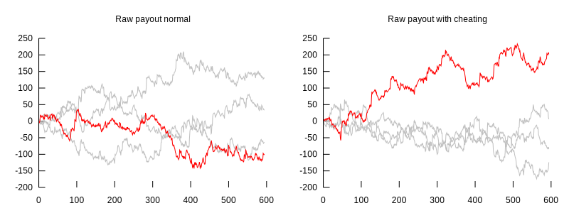
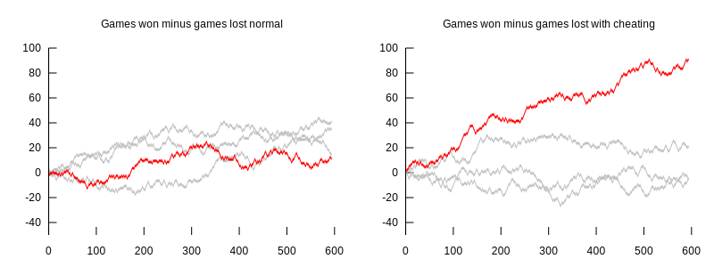

# What's this

This crate can be compiled to a DLL that can be [injected](https://en.wikipedia.org/wiki/DLL_injection) into the program [NetSchafkopf](https://www.cutesoft.com/downloads.htm). It can be used to improve NetSchafkopf, play automatically, or simply experiment with it.

## Compiling/running

Since I run Linux, I cross-compile this from Ubunto to Windows using [`cross`](https://github.com/cross-rs/cross), and use [Wine](https://www.winehq.org/) to run it:

```
# starting in the repository's root folder

# build the DLL to inject into NetSchafkopf
cd netschafkopf_helper
cross build --target i686-pc-windows-gnu --release

# build the injector that starts NetSchafkopf and injects the DLL
cd injector
cross build --target i686-pc-windows-gnu --release # build injector

# go back to the repository root
cd ../..

# run NetSchafkopf with the DLL
wine netschafkopf_helper/injector/target/i686-pc-windows-gnu/release/injector.exe
```

The injector starts NetSchafkopf, waits for its main window to appear and injects the DLL.

### Injector notes

* The injector looks for `NetSchk.exe` in common install directories. If your installation of NetSchafkopf differs, you must adjust the path.
* The injector assumes that `NetSchk.exe` is not already running.

### DLL notes

* The DLL relies on NetSchafkopf version 8.00 from 07.09.2020.
* The DLL assumes that the other players' names are `PcLinks`, `PcOben`, `PcRects`.
* The DLL does not support all of NetSchafkopf's rules:
  * Unsupported, will probably crash or hang: kurze Karte, Spiel ersteigern, Renonce, "Der Alte Muss", Überkreuzsitzende, Hochzeit, Doppeln, Schieberrunde
  * Ignored: "Scharf spielen", Nächstes Spiel doppelt, Stock, Anzahl Kontras, Zeitpunkt Kontras, Stoß übernimmt, Preise, Laufende, "Beim Tout Schneider und Schwarz werten"
* When the DLL is used for autoplay, it assumes "Alles automatisch berechnen" (from "Einstellungen -> Einstellungen für <Spieler> ändern -> Spielablauf -> Berechnung der Spielgewinne").

## Findings

I had the DLL autoplay NetSchafkopf so that it could play lots of games in short time (roughly 10 seconds per game).

I then auto-played 594 games for two scenarios:
* For "Spielabfrage", "Stoßen?" and "Kartenabfrage", simply auto-play what NetSchafkopf's "Vorschlag machen" suggests.
* For "Spielabfrage", "Stoßen?" and "Kartenabfrage" up to the second stich, simply auto-play what NetSchafkopf's "Vorschlag machen" suggests. For "Kartenabfrage" starting with the third stich, I had the DLL cheat (i.e. incorporate the knowledge of other players' hands) and compute the card that would lead to the highest payout *if every player played optimally* (i.e. `EMinMaxStrategy::SelfishMin` in `openschafkopf_lib`).

The following charts show the payout over time for the scenarios:



To account for expensive games due to Laufende or Stoß, here's the number of games won minus the number of games lost (i.e. each game won counted `+1`, each game lost counted `-1`) over time:



Each chart has four lines. The red line represents the values for "Gast", the other lines stand for the bots.

The left charts show a (relatively) balanced trend, whereas the right charts - the ones where the DLL chose the card - indicate that NetSchafkopf suggests cards that are suboptimal. **Note:** This does not necessarily mean that NetSchafkopf's suggestion's are bad if you do *not* know the other player's card.

## How does it look?


