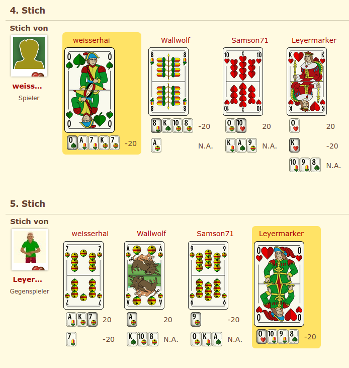

# What's this

This code can be compiled to a web extension, that - when enabled while browsing [`sauspiel.de/spiele/`](https://www.sauspiel.de/spiele) - automatically runs a (limited) analysis of the game.

## Compiling/running

*Note:* I only tested this on a recent Firefox (version >= 120), using [`web-ext`](https://github.com/mozilla/web-ext).

```
# starting in the repositories root folder

# convert Rust code to JavaScript/WebAssembly that will be included in the extension
cd sauspiel_webext
./run_wasm_pack_build.sh

# run the web extension
cd webext
./webext/run_webext_in_browser.sh
```
## How does it look?

Starting with the fourth-to-last trick, below each played card, the extension lists the cards a player could have played and shows the associated win/loss under the assumption that all players maximize their own reward. 

For [one of sauspiel's example games](https://www.sauspiel.de/spiele/1381879056) (**Caution**: Web design skills ahead.):


